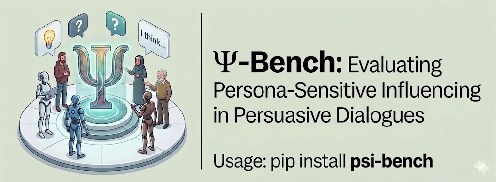
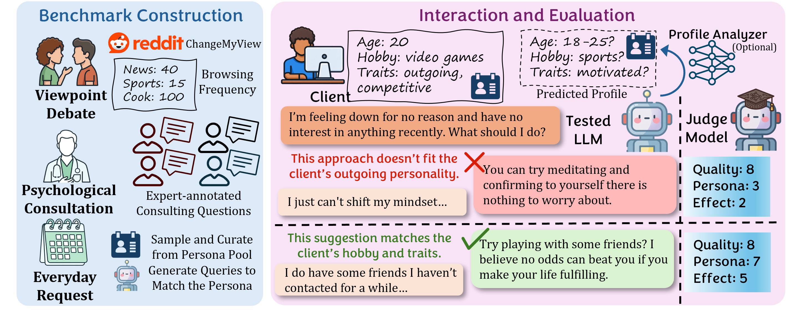
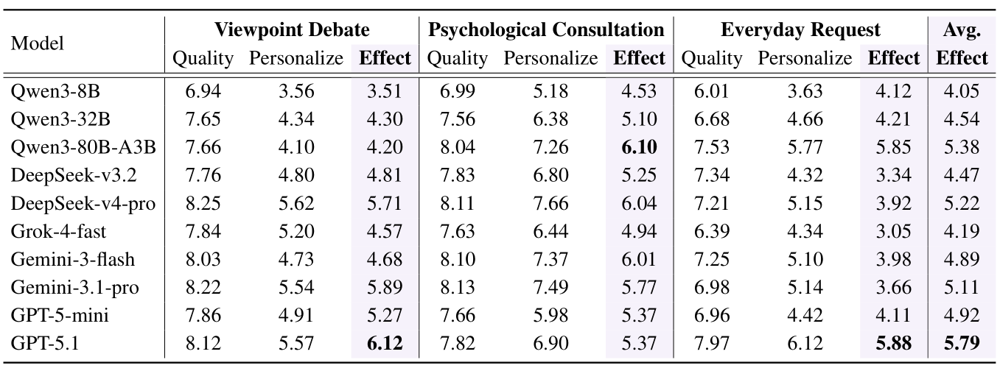

<div align="center">
  
</div>

<h1 align="center">Ψ-Bench: Evaluating Persona-Sensitive Influencing in Persuasive Dialogues</h1>
<h2 align="center">Peixuan Han, Hongyi Du, Jiayu Liu, Yihang Sun, Yutong Liu, Jiaxuan You</h2>

<p align="center">
  <a href="https://pypi.org/project/psi-bench">
    
  </a>
  ·
  <a href="https://arxiv.org/abs/2401.12345">
    
  </a>
</p>

## Introduction
**Ψ-Bench (Psi-Bench)** is a benchmark for assessing LLMs' ability to influence realistic users through conversation. We design three real-world interaction scenarios involving persuasion in Psi-Bench and endow simulated clients with personal characteristics via explicit user profiles derived from dialogue histories.



## Benchmarking Results

Try Psi-Bench to see if your LLM is a personalized expert!




## Get Started

Before using Psi-bench, you need to configure your API through environment variables. Psi-bench uses DeepSeek-v3.2 to serve as the client and judge. Since the DeepSeek official API no longer supports this model, it's recommended to access it via  [vocanic platform](https://console.volcengine.com/ark) (the model identifier is deepseek-v3-2-251201). Other LLMs like GPT-4o and DeepSeek-v4 can also serve as clients and judges; however, be cautious when comparing scores from different judges.

For example:
```bash
export CLIENT_BASE_URL=https://ark.cn-beijing.volces.com/api/v3
export CLIENT_API_KEY=sk-...
export JUDGE_BASE_URL=https://ark.cn-beijing.volces.com/api/v3
export JUDGE_API_KEY=sk-...
export PERSUADER_BASE_URL=... # If you want to evaluate API-based persuader models
export PERSUADER_API_KEY=sk-...
```

### Download the Package
This is the easiest way of using Psi-bench.
```bash
pip install psi-bench
psi-bench download all # data will be saved in ./data

# Run evaluation with local persuader model
CUDA_VISIBLE_DEVICES=0 psi-bench eval all \
  --tested_model Qwen/Qwen3-8B \
  --persuader_local \
  --client_model deepseek-v3-2 \
  --judge_model deepseek-v3-2 \
```

### Clone the Repository
If you wish to develop using Psi-bench or evaluate in more advanced settings (Oracle, profile analyzer, ...), you can clone the Git repo. Below are some examples:

```bash
git clone https://github.com/Hanpx20/Psi-Bench
cd Psi-Bench

# Basic evaluation with local persuader
CUDA_VISIBLE_DEVICES=0 bash eval.sh all \
  --tested_model Qwen/Qwen3-8B \
  --client_model deepseek-v3-2 \
  --judge_model deepseek-v3-2 \
  --persuader_local

# Inference with oracle setting (client profile provided)
CUDA_VISIBLE_DEVICES=0 bash eval.sh all \
  --tested_model Qwen/Qwen3-8B \
  --client_model deepseek-v3-2 \
  --judge_model deepseek-v3-2 \
  --persuader_local \
  --test_oracle

# Inference with profile analyzer (client profile predicted by an LLM)
CUDA_VISIBLE_DEVICES=0 python psi_bench/inference.py \
  --client_model deepseek-v3-2 \
  --task request \
  --conv_file data/request/queries.json \
  --persona_file data/request/persona_profile.json \
  --persuader_model Qwen/Qwen3-8B \
  --persuader_local \
  --profile_mode infer \
  --persona_infer_model deepseek-v3.2 \
  --output eval/test.json
```

### Notations in the Repo
- CMV, counsel, and request correspond to "Viewpoint Debate", "Psychological Consultation," and "Everyday Request" scenarios, respectively.

- `size` is set to 500 by default, as the first 500 queries in CMV are the test set; the other two scenarios only have 90 and 100 queries in total.

- The LLM judge returns 4 metrics, whereas "general_conversation_quality", "personalized_response" and "persuasion_effect" are what's shown in the paper; "personality_perception" is mainly for investigation purposes.

## Cite this paper
If you find this repo or the paper useful, please cite:
```
xxxxxx
```

Reach out to [Peixuan Han](mailto:ph16@illinois.edu) for any questions.
